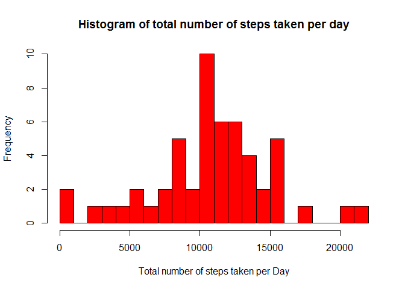
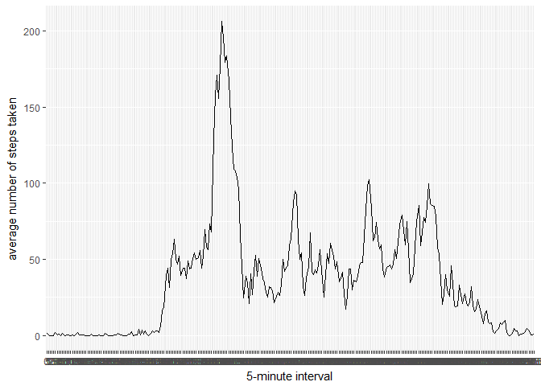
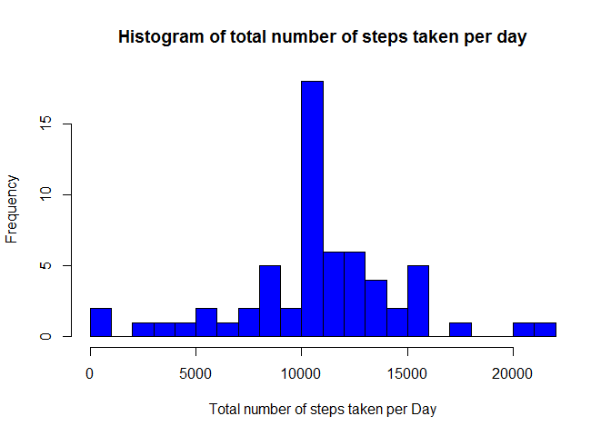
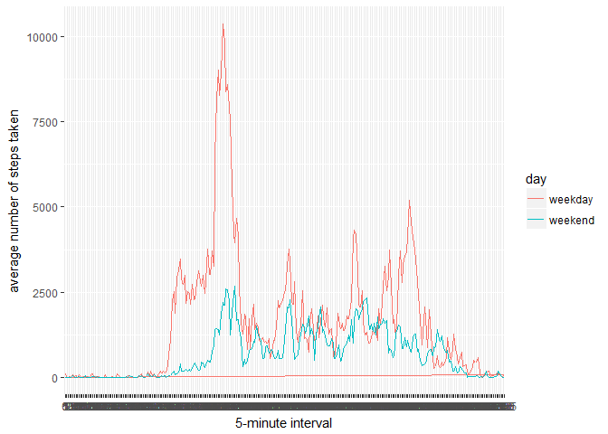

# Reproducible Research: Peer Assessment 1


```r
library(ggplot2)
library(plyr)
library(Hmisc)
library(dplyr)
library(knitr)
```


## Loading and preprocessing the data


```r
unzip(zipfile="activity.zip")
data <- read.csv("activity.csv")
data$date <- as.Date(data$date, format = "%Y-%m-%d")
data$interval <- as.factor(data$interval)
dataWithout_na <- data[complete.cases(data),]
```

## What is mean total number of steps taken per day?


```r
# total number of steps taken per day
totalSteps <- aggregate(steps ~ date, dataWithout_na, sum)
names(totalSteps)[2] <- "total_steps"
head(totalSteps,20)
```

```
##          date total_steps
## 1  2012-10-02         126
## 2  2012-10-03       11352
## 3  2012-10-04       12116
## 4  2012-10-05       13294
## 5  2012-10-06       15420
## 6  2012-10-07       11015
## 7  2012-10-09       12811
## 8  2012-10-10        9900
## 9  2012-10-11       10304
## 10 2012-10-12       17382
## 11 2012-10-13       12426
## 12 2012-10-14       15098
## 13 2012-10-15       10139
## 14 2012-10-16       15084
## 15 2012-10-17       13452
## 16 2012-10-18       10056
## 17 2012-10-19       11829
## 18 2012-10-20       10395
## 19 2012-10-21        8821
## 20 2012-10-22       13460
```

```r
# histogram
hist(
        totalSteps$total_steps,
        col = "red",
        main = "Histogram of total number of steps taken per day",
        xlab = "Total number of steps taken per Day",
        breaks = 20
)
```

<!-- -->

```r
# Mean
mean(totalSteps$total_steps)
```

```
## [1] 10766.19
```

```r
# Median
median(totalSteps$total_steps)
```

```
## [1] 10765
```

## What is the average daily activity pattern?

```r
averageDailyStepsPerInterval <- aggregate(x=list(meanSteps=dataWithout_na$steps), by=list(interval=dataWithout_na$interval), FUN=mean, na.rm=TRUE)
names(averageDailyStepsPerInterval)[2] <- "steps"

# Time Series Plot
ggplot(data=averageDailyStepsPerInterval, aes(x=interval, y=steps, group = 1)) +
    geom_line() +
    xlab("5-minute interval") +
    ylab("average number of steps taken") 
```

<!-- -->

```r
#  5-minute interval, on average across all the days in the dataset, with the maximum number of steps
averageDailyStepsPerInterval[which.max(averageDailyStepsPerInterval$steps),]
```

```
##     interval    steps
## 104      835 206.1698
```

## Imputing missing values

```r
# Total number of missing values in the dataset 
sum(is.na(data$steps))
```

```
## [1] 2304
```

```r
# Strategy for filling in all of the missing values in the dataset
# NA replaced with mean
# New Dataset dataFilledNA created
dataFilledNA <- ddply(data, "interval", mutate, steps = round(impute(steps, mean)))
```

```
## Warning: package 'bindrcpp' was built under R version 3.3.3
```

```r
# New dataset for total number of steps taken per day with additional data
totalStepsFilledNA <- aggregate(steps ~ date, dataFilledNA, sum)
names(totalStepsFilledNA)[2] <- "total_steps"
head(totalStepsFilledNA,20)
```

```
##          date total_steps
## 1  2012-10-01       10762
## 2  2012-10-02         126
## 3  2012-10-03       11352
## 4  2012-10-04       12116
## 5  2012-10-05       13294
## 6  2012-10-06       15420
## 7  2012-10-07       11015
## 8  2012-10-08       10762
## 9  2012-10-09       12811
## 10 2012-10-10        9900
## 11 2012-10-11       10304
## 12 2012-10-12       17382
## 13 2012-10-13       12426
## 14 2012-10-14       15098
## 15 2012-10-15       10139
## 16 2012-10-16       15084
## 17 2012-10-17       13452
## 18 2012-10-18       10056
## 19 2012-10-19       11829
## 20 2012-10-20       10395
```

```r
# histogram
hist(
        totalStepsFilledNA$total_steps,
        col = "blue",
        main = "Histogram of total number of steps taken per day",
        xlab = "Total number of steps taken per Day",
        breaks = 20
)
```

<!-- -->

```r
# Mean
mean(totalStepsFilledNA$total_steps)
```

```
## [1] 10765.64
```

```r
# Median
median(totalStepsFilledNA$total_steps)
```

```
## [1] 10762
```


## Are there differences in activity patterns between weekdays and weekends?

```r
# Added day column for each day to indicate whether date is weekday or weekend

dataFilledNA$day <- ifelse(weekdays(totalStepsFilledNA$date) %in% c("Saturday", "Sunday"), "weekend", "weekday")
daywiseSummary  <- dataFilledNA %>% group_by(day, interval) %>% summarise(steps = sum(steps))

# Plot to show activity patterns for Weekend and Weekdays.
# Plot clearly indicates 

qplot(interval, steps, data = daywiseSummary,group = 1, color = day, geom = "path", 
       xlab = "5-minute interval", 
       ylab = "average number of steps taken") +
       scale_colour_discrete(name = "day", label = c("weekday","weekend"))
```

<!-- -->

